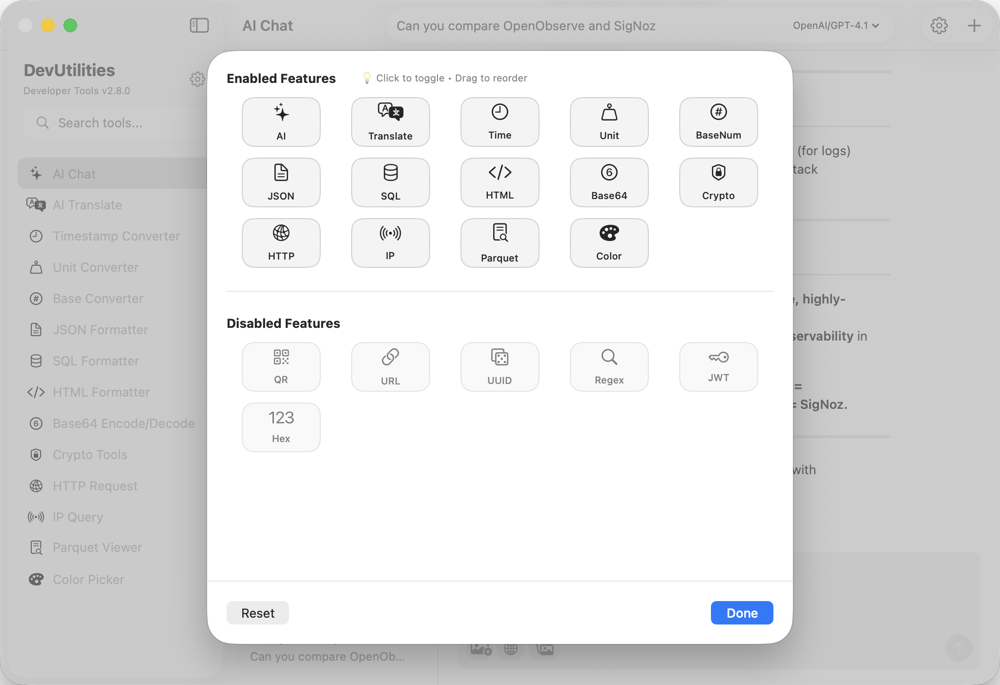
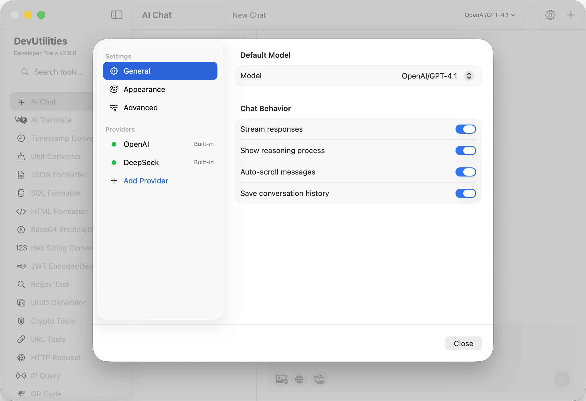
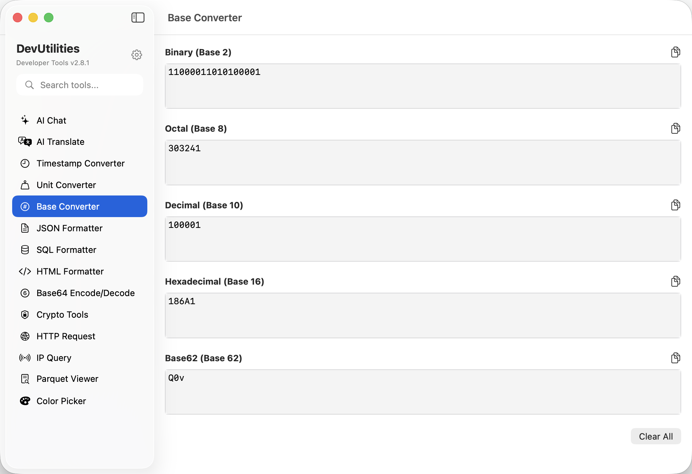
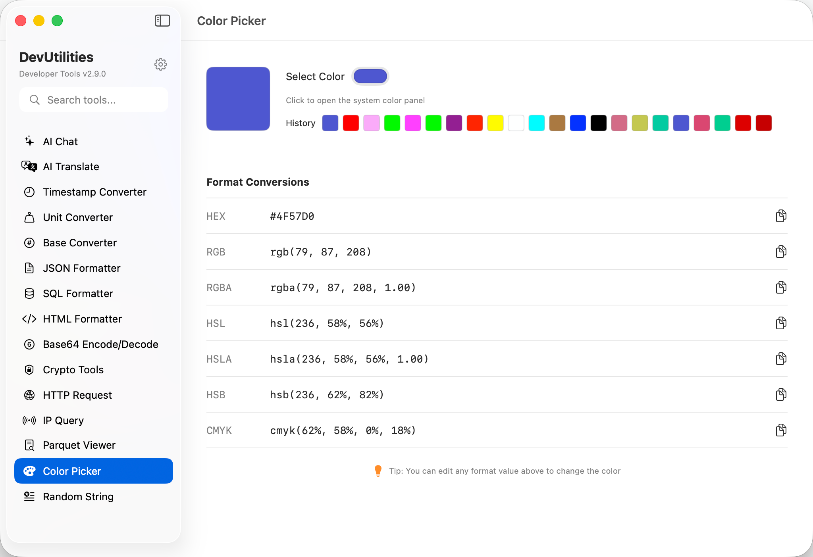

# DevUtilities

A native macOS application for developers, containing 23 essential tools commonly used in software development.

> This tool was 100% developed by `Claude Code`.

## Download

[Download on the App Store](https://apps.apple.com/app/devutilities/id6753612551)

## Features

- **AI Chat** - Intelligent AI assistant with custom model support, flexible API configuration, and enhanced user experience for development questions
- **AI Translate** - **NEW TTS** Professional translation tool with 3 modes, 19 language support, text-to-speech playback, and special word mode with detailed explanations
- **Timestamp Converter** - Convert between timestamps and human-readable dates with multiple format support
- **Unit Converter** - Convert between different units (Data, Time, Length, Weight, Temperature, Area, Volume)
- **Base Converter** - Mutual conversion between binary, octal, decimal, hexadecimal, and Base62 number systems with real-time validation
- **Color Picker** - Professional color format converter with HEX, RGB, RGBA, HSL, HSLA, HSB, and CMYK support and color history
- **Text Compare** - **NEW** Dedicated side-by-side text comparison with visual diff highlighting and real-time status
- **JSON Formatter** - Format, validate, and **compare JSON** with visual CodeMirror diff editor
- **SQL Formatter** - Format and minify SQL queries with **diff mode** and syntax validation
- **HTML Formatter** - Format and minify HTML with **diff mode** and proper tag indentation
- **Base64 Encode/Decode** - Encode and decode Base64 strings
- **Hex String Converter** - Bidirectional hex-to-string conversion with UTF-8/UTF-16/ASCII encoding support and real-time processing
- **JWT Encoder/Decoder** - Encode and decode JSON Web Tokens with HMAC and RSA signature support
- **Regex Test** - Test regular expressions with pattern matching
- **UUID Generator** - Generate UUIDs in various formats including v7 with timestamp extraction
- **Random String Generator** - **NEW** Cryptographically secure random string generation with 5 presets and advanced requirements
- **URL Tools** - URL encoding/decoding and parsing
- **HTTP Request** - Full-featured HTTP client with method selection, headers, auth, response handling, and JSON tree view
- **IP Query** - Discover your IP address and query geolocation data for any IP
- **QR Code** - Generate QR codes with multiple sizes and error correction levels, scan QR codes from images
- **Parquet Viewer** - Read and explore Parquet / arrow files with schema inspection and data export
- **Crypto Tools** - Comprehensive cryptographic suite with hash functions (MD5, CRC32, SHA-1/256/384/512), symmetric encryption (AES-GCM-256), and asymmetric encryption (RSA-2048/4096)
- **Currency Converter** - **NEW** Real-time currency conversion with 38 currencies, 24-hour caching, 30-day price history, and 24-hour trend indicators

## Key Features

- **Customizable Tool Management** - Enable/disable tools and organize them with drag-and-drop interface
- **Search Functionality** - Quickly find tools using the search bar in the sidebar
- **Selectable Results** - Copy results directly from the output areas
- **Modern UI** - Clean, intuitive interface designed for macOS
- **Real-time Conversion** - Instant results as you type
- **Text-to-Speech** - **NEW** Native macOS TTS for AI Translate with multi-language voice support

## Version

Current version: 2.11.0

## What's New in v2.11.0

- **Text Compare Tool**: NEW dedicated tool for side-by-side text comparison with visual diff highlighting
- **Enhanced JSON Formatter**: Added diff mode with visual CodeMirror diff editor for comparing JSON documents
- **Enhanced HTML Formatter**: Added diff mode for side-by-side HTML comparison with syntax highlighting
- **Enhanced SQL Formatter**: Added diff mode for comparing SQL queries with automatic formatting
- **Unified Diff Experience**: Consistent diff interface across all formatters with real-time status updates
- **Optimized Comparison**: Reusable comparison logic pattern for better code maintainability
- **Sample Data**: Each diff mode includes meaningful sample data pairs
- **Character & Line Metrics**: Detailed metrics display for both sides of comparison

## What's New in v2.10.0

- **Currency Converter**: NEW tool for real-time currency conversion with comprehensive features
- **38 Currencies Supported**: Major global currencies including USD, EUR, GBP, JPY, CNY, KRW (Korean Won), INR (Indian Rupee), and 33 others
- **24-Hour Smart Caching**: Intelligent exchange rate caching to minimize API calls while keeping data fresh
- **30-Day Price History**: Incremental daily snapshots automatically build a complete 30-day historical view
- **24-Hour Trend Indicators**: Visual up/down arrows with percentage change compared to yesterday
- **Flexible Number Input**: Supports both formatted numbers (1,000,000) and plain numbers (1000000)
- **Optimized Performance**: History loads only when currency pair changes, providing instant conversion on amount changes
- **Clean Two-Column Layout**: Intuitive UI with currency pickers, swap button, and quick amount shortcuts
- **Offline Mode**: Continues working with cached data when network is unavailable

## What's New in v2.9.0

- **Random String Generator**: NEW tool for cryptographically secure random string generation
- **Customizable Character Sets**: Choose from uppercase, lowercase, numbers, and symbols
- **5 Built-in Presets**: Strong Password, API Key, Hex String, PIN Code, and Readable Code templates
- **Advanced Requirements**: Enforce minimum requirements for uppercase, numbers, or special characters
- **Bulk Generation**: Create up to 20 random strings simultaneously
- **Flexible Length**: Configure string length from 1 to 100 characters
- **Secure by Design**: Uses SecRandomCopyBytes for cryptographically secure randomness

## What's New in v2.8.2

- **Text-to-Speech (TTS)**: Integrated native macOS TTS in AI Translate for listening to both source and translated text
- **Multi-language TTS**: Supports all 19 translation languages with proper voice selection
- **Animated Speaker Icons**: Visual feedback with smooth wave animations during playback
- **Smart Sanitization**: Prevents audio errors by escaping special characters
- **Thread-safe**: Optimized implementation without performance warnings

## Screenshots

#### customizable features

#### AI Chat

#### AI Translate

#### Timestamp Converter

#### Unit Converter

#### Base Converter

#### Color Picker

#### Json Formatter

#### SQL Formatter

#### HTML Formatter

#### Base64 Encode/Decode

#### Hex String Converter

#### JWT Encoder/Decoder

#### URL Tools

#### Regex Test

#### UUID Generator

#### Http Request

#### IP Query

#### QR Code

#### Parquet Viewer

#### Crypto Tools

